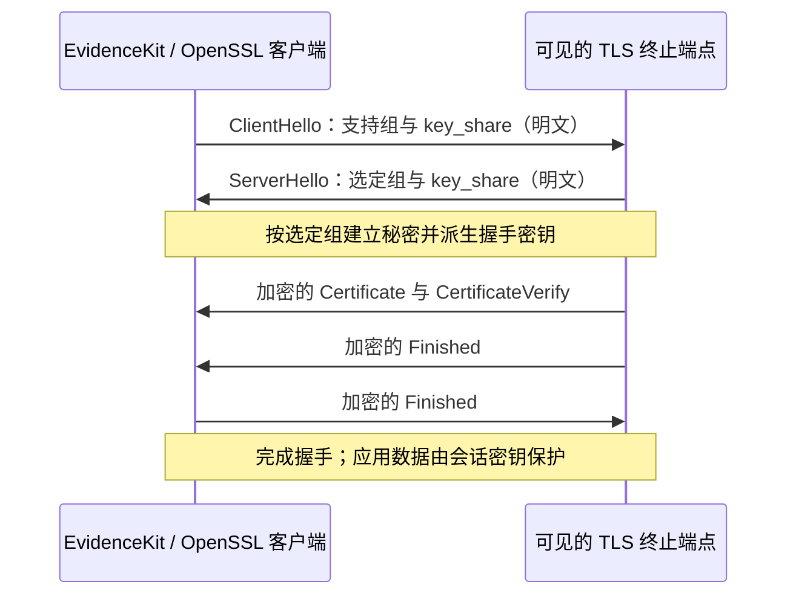

# 怎样判断对方的后量子能力

先把“抗量子能力”拆成两个问题：**能否建立具有后量子成分的会话密钥？能否用后量子方法验证身份？** TLS 混合组主要回答前一个问题。一个端点可以使用 `X25519MLKEM768`，同时使用 RSA 证书和 RSA-PSS 握手签名。

OpenSSL 输出能反映本地协议栈认为完成的握手、实际组和验证结果。当前工具不抓包、不导出秘密、不追踪远端函数；图中的内部派生步骤来自协议定义，不应写成本工具直接观察了远端每个密钥输入。[TLS 1.3 定义](https://www.rfc-editor.org/rfc/rfc8446.html)

## 用多条探测识别能力与偏好

| 观察 | 可以写的结论 | 需要保留的边界 |
| --- | --- | --- |
| 强制某混合组，完成握手并验证身份 | 此端点在本次条件下能使用该混合组 | 不证明全部后端、其他协议、实现无漏洞或认证抗量子 |
| 默认连接选中传统组，强制混合成功 | 默认观测与混合能力不同；存在可用混合路径 | 默认选择受客户端配置和服务端偏好影响 |
| 强制混合被协议拒绝，传统握手成功 | 本次混合提案未被接受，传统路径可用 | 不排除其他组、SNI、策略、客户端认证要求或后端变化 |
| 混合与传统同时提出，选中传统组 | 当前混合提案下使用了传统路径 | 单凭这一条不能判断降级攻击 |
| 超时、连接失败、身份验证失败 | 无法完成可靠判断 | 不能输出“目标不支持 PQC” |
| 跳过身份验证后混合成功 | 与一个未验证身份的对端观察到混合握手 | 不能归因到预期服务的已认证能力 |

“支持”与“要求”也不同。传统对照成功，说明端点对该请求允许传统连接；它不表示混合能力无效。若业务要求所有连接必须混合，这属于另一个策略验收条件，需要先明确允许的组、客户端范围及例外。

## 证据维度，而非安全排名

| 维度 | 当前 MVP 的实际观察 | 未覆盖内容 |
| --- | --- | --- |
| 客户端身份 | OpenSSL 版本及可用组 | 构建供应链审计、完整 provider 来源追踪 |
| 连接条件 | 目标、SNI、组提案、信任配置与时间 | 多出口、多地区与全部负载均衡后端 |
| 密钥交换 | 完成的 TLS 1.3 握手及实际组选定 | 远端 ML-KEM 调用、随机数、实现侧信道 |
| 身份验证 | 信任链/服务名称验证是否通过 | 完整的 PQ 认证与证书链策略认证 |
| 签名 | 本地输出可见的握手签名信息 | 把握手签名误当作证书签发算法；全面证书链解析 |
| 行为对照 | 混合限定、传统限定与混合提案 | 攻击注入、重连恢复、rekey、IKE 与真实网关转发 |
| 可追溯性 | 原始 stdout/stderr、结果与哈希 | 哈希只能发现变化，不能替代签名、可信时间或独立见证 |

报告如果观察到 RSA-PSS 或 ECDSA，应把它显示为传统握手认证。CertificateVerify 是服务器对本次握手内容的签名；证书里的签发算法是 CA 对证书的签名。两者不能用同一个字段代替。完整的 PQ 身份认证还需考虑证书链、信任锚、实际签名与策略，当前版本不作该认证结论。

## 标准映射

`X25519MLKEM768`、`SecP256r1MLKEM768`、`SecP384r1MLKEM1024` 对应 [RFC 10024](https://www.rfc-editor.org/rfc/rfc10024.html) 定义的具体混合组；[RFC 9954](https://www.rfc-editor.org/rfc/rfc9954.html) 说明一般构造。这些标准解释组的含义，不意味着仅凭名称就完成标准一致性、FIPS 模块认证或产品安全认证。

## 阅读报告时的三个判断

1. 是否是你要评估的 TLS 终止点，服务身份是否通过验证？
2. 哪一条新握手实际选中哪一组，失败属于协议拒绝还是无法判定？
3. 你提出的结论是否超出了日志、配置和实验条件真正覆盖的范围？

若需要证明远端内部密钥链，应另设受控端点实验，固定源码和构建身份，追踪组实现到 TLS KDF 的路径，并增加负向与回归测试。远程能力探测与内部实现验证互相补充，但不能互相代替。
