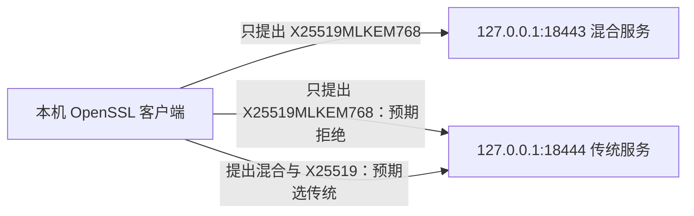

# 手工先走一条真实握手，再运行自动演示

本实验不访问外部设备。你在同一台机器上启动两个回环地址服务：一个只接受混合组，另一个只接受传统组。先亲手观察“能协商”“未接受提案”“选择传统”三种结果，再使用 `demo` 固化重复执行。

目标是解释这些结果为什么支持对应结论，能够修改一个组提案并诊断一次身份验证失败。脚本运行成功不是学习掌握的判据。



## 先读懂终端写法

所有命令使用 POSIX 风格 shell，如 Linux 的 Bash。除第一条 `cd` 外，后续工作目录都保持为仓库根目录。不要把整页一次粘贴执行；每步运行后读日志，再继续。

| 写法 | 含义 |
| --- | --- |
| `cd pqc-evidencekit` | 改变当前目录。相对路径从当前位置寻找，绝对路径从 `/` 开始 |
| `./program` | 运行当前目录的程序；`./` 不意味着系统会自动找到它 |
| `NAME=value` | 定义 shell 变量；`$NAME` 读取值。`export NAME` 才把它传给子进程 |
| `"$NAME"` | 展开变量并保持为一个参数，路径含空格时尤其需要 |
| `'文字'` | 保留字面内容，不展开 `$NAME` 等写法 |
| `$(command)` | 把命令输出存入另一条命令或变量；本实验用来创建临时目录 |
| `A \| B` | 把 A 的标准输出交给 B 的标准输入 |
| `>file` | 保存标准输出，会覆盖同名文件；本实验每条观察用独立名称 |
| `2>&1` | 把标准错误也交给当前标准输出目标，保留完整诊断 |
| 行尾 `\` | 命令续行，下一行仍是同一条命令 |
| 行尾 `&` | 让服务在后台运行；`$!` 是刚启动后台进程的 PID |
| `$?` | 上一条命令的退出状态，必须立即保存或查看 |

我们只绑定 `127.0.0.1`，使用大于 1024 的端口；生成文件属于当前用户，无需 `sudo`。本实验不改防火墙、路由或系统服务。

## 检查运行工具

如果终端在仓库父目录：

```sh
cd pqc-evidencekit
```

`cd` 的参数是目录名，成功通常没有输出。出现“目录不存在”时，先定位你下载或克隆的仓库；不要用不相关的目录继续实验。

```sh
EVIDENCEKIT_OPENSSL=openssl
"$EVIDENCEKIT_OPENSSL" version -a
"$EVIDENCEKIT_OPENSSL" list -tls1_3 -tls-groups
```

第一条选择程序名。`version -a` 查看版本和构建信息；`list` 的两个选项限制到 TLS 1.3 可用组。应有 OpenSSL 3.5+ 与 `X25519MLKEM768`，并留意其他待测组。若版本过旧或组缺失，把变量改为实际新版程序的绝对路径，再重试。组不可用是客户端环境问题，不是服务器不支持的证据。

## 创建本次临时身份

```sh
EVIDENCEKIT_LAB="$(mktemp -d "${TMPDIR:-/tmp}/pqc-evidencekit-manual.XXXXXX")"
"$EVIDENCEKIT_OPENSSL" req -x509 -newkey rsa:2048 -noenc \
  -keyout "$EVIDENCEKIT_LAB/key.pem" -out "$EVIDENCEKIT_LAB/cert.pem" \
  -days 1 -subj '/CN=localhost' \
  -addext 'subjectAltName=DNS:localhost,IP:127.0.0.1'
```

`mktemp -d` 创建一个独有目录；`${TMPDIR:-/tmp}` 读取现有临时目录设置，未设置时用 `/tmp`。目录保存在变量中，后续文件都写入它。

`req` 生成身份材料，`-x509` 输出自签名证书，`-newkey rsa:2048` 新建 RSA 密钥；`-noenc` 让本地临时服务无需输入密钥口令。`-keyout` 与 `-out` 分别指定私钥和证书文件，`-days 1` 限制有效期，`-subj` 指定名称，SAN 指定要验证的域名/IP。预期看到密钥生成输出与两个文件。写文件失败时检查临时目录及权限。

这里故意使用传统 RSA 身份：后面的混合密钥交换成功，也不会让这个身份自动变成后量子认证。私钥仅供本次演示，最后删除，不进入报告或 Git。

## 启动两个端点

```sh
"$EVIDENCEKIT_OPENSSL" s_server -accept 127.0.0.1:18443 \
  -cert "$EVIDENCEKIT_LAB/cert.pem" -key "$EVIDENCEKIT_LAB/key.pem" \
  -tls1_3 -groups X25519MLKEM768 -www \
  > "$EVIDENCEKIT_LAB/hybrid-server.log" 2>&1 &
EVIDENCEKIT_HYBRID_PID=$!
```

`s_server` 启动服务。`-accept` 只监听本机 18443，`-cert`/`-key` 提供刚生成的身份，`-tls1_3` 限定协议，`-groups` 限定交换组，`-www` 返回简单测试页面。日志重定向后服务在后台继续运行；立即用 `$!` 保存 PID，清理时只停止本次进程。

```sh
"$EVIDENCEKIT_OPENSSL" s_server -accept 127.0.0.1:18444 \
  -cert "$EVIDENCEKIT_LAB/cert.pem" -key "$EVIDENCEKIT_LAB/key.pem" \
  -tls1_3 -groups X25519 -www \
  > "$EVIDENCEKIT_LAB/classical-server.log" 2>&1 &
EVIDENCEKIT_CLASSICAL_PID=$!
```

第二条只改端口与组。查看服务日志：

```sh
cat "$EVIDENCEKIT_LAB/hybrid-server.log"
cat "$EVIDENCEKIT_LAB/classical-server.log"
```

`cat` 打印文件原文。应看到服务接受连接的准备信息。`Address already in use` 表示端口被占用；选择两个新的非特权端口，并同步替换后续命令。不要停止不属于本实验的服务。组不认识时回到环境检查。

## 观察混合握手

```sh
printf 'GET / HTTP/1.0\r\nHost: localhost\r\n\r\n' | \
  "$EVIDENCEKIT_OPENSSL" s_client -connect 127.0.0.1:18443 \
  -servername localhost -verify_hostname localhost -verify_return_error \
  -CAfile "$EVIDENCEKIT_LAB/cert.pem" -tls1_3 \
  -groups X25519MLKEM768 -brief -no_ign_eof \
  > "$EVIDENCEKIT_LAB/hybrid-client.log" 2>&1
EVIDENCEKIT_HYBRID_EXIT=$?
cat "$EVIDENCEKIT_LAB/hybrid-client.log"
printf 'client exit: %s\n' "$EVIDENCEKIT_HYBRID_EXIT"
```

`printf` 发送一个最小请求，`\r\n` 是 HTTP 换行；管道将其交给 `s_client`。`-connect` 是连接地址；`-servername` 发送 SNI，`-verify_hostname` 指定预期身份，`-verify_return_error` 让证书错误中止握手，`-CAfile` 显式信任本次自签名证书。`-tls1_3` 与 `-groups` 限定探测范围，`-brief` 打印诊断摘要，`-no_ign_eof` 在输入结束时允许退出。

预期看到 TLS 1.3、`X25519MLKEM768` 与验证成功。输出标签依 OpenSSL 版本可能不同，查看实际组字段，不依据提案里的字符串判断。RSA-PSS 等签名字段属于本次握手认证，与混合交换的组选定分开读取。退出状态要和日志一起解释。

## 同一混合提案访问传统服务

```sh
printf 'GET / HTTP/1.0\r\nHost: localhost\r\n\r\n' | \
  "$EVIDENCEKIT_OPENSSL" s_client -connect 127.0.0.1:18444 \
  -servername localhost -verify_hostname localhost -verify_return_error \
  -CAfile "$EVIDENCEKIT_LAB/cert.pem" -tls1_3 \
  -groups X25519MLKEM768 -brief -no_ign_eof \
  > "$EVIDENCEKIT_LAB/rejected-client.log" 2>&1
EVIDENCEKIT_REJECTED_EXIT=$?
cat "$EVIDENCEKIT_LAB/rejected-client.log"
cat "$EVIDENCEKIT_LAB/classical-server.log"
printf 'client exit: %s\n' "$EVIDENCEKIT_REJECTED_EXIT"
```

唯一关键变化是端口 18444。预期握手被拒绝，服务日志可能显示没有可用共享组，客户端看到握手失败 alert。两端配置都是你控制的，所以可以定位为组不相交。对于未知外部端点，类似失败仍需排除访问策略等原因，不能直接推出它完全不支持 PQC。

## 改成混合与传统一起提出

```sh
printf 'GET / HTTP/1.0\r\nHost: localhost\r\n\r\n' | \
  "$EVIDENCEKIT_OPENSSL" s_client -connect 127.0.0.1:18444 \
  -servername localhost -verify_hostname localhost -verify_return_error \
  -CAfile "$EVIDENCEKIT_LAB/cert.pem" -tls1_3 \
  -groups X25519MLKEM768:X25519 -brief -no_ign_eof \
  > "$EVIDENCEKIT_LAB/mixed-client.log" 2>&1
EVIDENCEKIT_MIXED_EXIT=$?
cat "$EVIDENCEKIT_LAB/mixed-client.log"
printf 'client exit: %s\n' "$EVIDENCEKIT_MIXED_EXIT"
```

OpenSSL 的组列表用 `:` 分隔；EvidenceKit CLI 的 `--groups` 则用逗号。预期成功并选中 `X25519`。这说明本实验允许并使用了传统路径；没有攻击者，因此不能把结果命名为“已发现降级攻击”。

可以自己将 18444 改为 18443，保留混合提案，预测再检查结果。这是本课要求的一个小修改。

## 注入一个可恢复的身份错误

复制成功的混合握手命令，将 `-verify_hostname localhost` 改为 `-verify_hostname wrong.example`，输出保存为 `identity-error-client.log`。保持连接地址、SNI 与组不变。

预期身份检查失败。恢复 `localhost` 后重试成功。你需要解释：失败发生在身份验证，不能拿它判断组不可用；删除验证要求虽然可以辅助诊断，却失去了“对方是预期服务”的保证。

## 保存原始结果与清理

```sh
mkdir -p report/manual
cp "$EVIDENCEKIT_LAB/"*.log report/manual/
sha256sum report/manual/*.log > report/manual/manifest.sha256
```

`mkdir -p` 创建报告目录，存在则保留。`cp` 把本次原始日志复制出来，通配符 `*.log` 只选择日志。`sha256sum` 为每份日志生成内容哈希，输出重定向到清单；macOS 可使用 `shasum -a 256` 替代。哈希供后续发现文件变化，不证明日志来源绝对可信。不要将临时私钥复制到报告。

```sh
kill "$EVIDENCEKIT_HYBRID_PID" "$EVIDENCEKIT_CLASSICAL_PID"
wait "$EVIDENCEKIT_HYBRID_PID"
wait "$EVIDENCEKIT_CLASSICAL_PID"
rm -r -- "$EVIDENCEKIT_LAB"
```

`kill` 通知两个记录的服务退出，`wait` 回收后台子进程；因终止信号产生非零退出状态是正常的。`rm -r` 删除本次临时目录，`--` 表示后面是路径。先确认变量仍是本次 `mktemp` 生成的目录；不要替换为仓库或系统路径。保存在 `report/manual` 的日志不受影响。

## 再用自动化回归同一条路径

```sh
python3 -m pqc_evidencekit doctor
python3 -m pqc_evidencekit demo --out report/demo
PQC_EVIDENCEKIT_INTEGRATION=1 python3 -m unittest discover -s tests -v
```

`python3 -m` 从仓库中的模块启动程序；`doctor` 对应手工环境检查。`demo` 对应临时身份、服务创建、混合/传统探测、结果对比与清理，并自动选择空闲端口。最后一条只为该子进程设置环境变量，要求测试套件运行真实集成路径。可在命令中用 `--openssl` 选择新版工具；集成测试应使用同样的可执行文件环境。

自动化额外探测其他可用混合组与默认配置，把原始结果整理成 HTML/JSON 并记录哈希。它复用上面相同的机制；没有替你证明远端内部密钥链、认证抗量子或整个网关数据面。

## 自测与掌握门槛

- 解释支持组与实际协商组的区别，并从一份真实日志指出实际组选定。
- 解释 SNI、身份名称与信任 CA 各解决什么问题。
- 解释为什么 RSA 身份可以搭配 ML-KEM 混合交换。
- 手工复现成功与组不相交失败，并恢复一次身份错误。
- 对未知目标超时，写出“无法判定”及下一步检查，不写成“不支持 PQC”。

这些能力可迁移到网关版本回归、代理终止点检查与 IKE 的提案分析。IKE 的交换与数据面需要独立实验，不能把本 TLS 实验直接当成 IPsec 验证。

命令选项依据：[OpenSSL s_client](https://docs.openssl.org/3.5/man1/openssl-s_client/)、[s_server](https://docs.openssl.org/3.5/man1/openssl-s_server/)、[req](https://docs.openssl.org/3.5/man1/openssl-req/)、[list](https://docs.openssl.org/3.5/man1/openssl-list/)。
